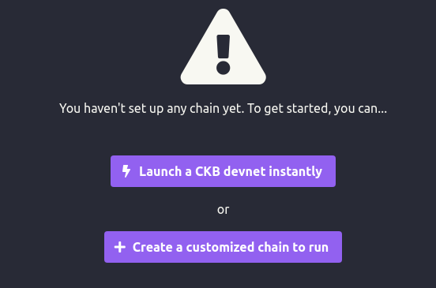

<!--The Nervos CKB (Common Knowledge Base) is the bottom-most layer in the Nervos ecosystem. It serves as a foundation to build on and provides trust to all layers built on top.-->

<!--CKB nodes can be categorized into three types:--><!--**Full Nodes**: Full nodes verify new blocks and transactions, relay blocks and transactions, and select the chain fork on which they agree. Full nodes are the verifiers of the network. The CKB nodes used for the development and testing are **full nodes**.--><!--**Mining Nodes**: Mining nodes participate in the CKB consensus process. The mining nodes collect new transactions, package them into blocks and produce new blocks when they have found a Proof-of-Work. Mining nodes do not have to store the entire transaction history, only the current cell set.--><!--**Light Nodes**: Light nodes trust full nodes, only subscribe and store a subset of cells that they are concerned with. They use minimal resources. Users increasingly rely on mobile devices and mobile apps to access the Internet, the light node is designed to run on mobile devices.-->

The CKB nodes used in the DApp development are **full nodes** that are the verifiers of the network. A CKB full node verifies new blocks and transactions, relays blocks and transactions, and selects the chain fork on which it agrees.

## CKB Networks

A CKB node can be set up to connect and interact with one of the following CKB networks:

- **Mainnet (Lina)**: The Mainnet is the main CKB public network. The real-time information of the Lina Mainnet can be checked on the [CKB Explorer](https://explorer.nervos.org/) page.

- **Testnet (Aggron4)**: The Testnet is used to test applications integration and smart contracts in real environment with actual data. 

- **DEV Chain**:  The DEV chain is a local blockchain that provides an efficient and useful development mode for building and testing applications. <!--This is the recommended network for starters and DApp developers.--> 

:::tip
For the first time to start running a node on the **Testnet**, syncing data requires upwards of one hour for the current number (**1,300,000+**) of blocks depending on the network connection. The real-time block number on the Testnet can be checked on the [CKB Explorer](https://explorer.nervos.org/aggron) page.<br/>
To get CKB capacity for an account on the Testnet, go to [https://faucet.nervos.org](https://faucet.nervos.org/) and paste the Testnet address of the address in the address input box, then click the **Claim** button. For more information, see [Create Accounts](../preparation/createaccount).<br/>

To get CKB capacity for an account on the **DEV** chain, specify the account as the miner in the chain configurations for receiving mining rewards. For more information, see [Create Accounts](../preparation/createaccount).
:::

## Installation Options

There are two options for installing a CKB node:

- **Install a CKB node by using the pre-built installer package.**

  The pre-built installer package contains the following tools: 

  - **ckb**: The ckb tool is the main tool that initiates configurations, run CKB nodes, synching block data and mining. 

  - **ckb-cli**: ckb-cli is a command line tool that provides the functions of rpc requests, creating CKB addresses, managing wallets, sending transactions, and depositing to Nervos DAO etc.

- **Install a CKB node by using Tippy.**

  **Tippy** is a tool that helps set up and manage CKB nodes. It can install and start running a CKB node by one simple click.

  :::note
  Tippy is currently in the development and experimental stage. (To be updated)
  :::
## Install a CKB Node by Using the Pre-built Installer Package

The following examples are verified on **Ubuntu 20.04.2**. Steps on the other platforms can be adjusted accordingly.

### **Step 1. Download the CKB Pre-built Installer Package.**

The following example downloads the CKB version 0.39.0. All releases can be found on the [CKB releases](https://github.com/nervosnetwork/ckb/releases) page.

```shell
$ export TOP=$(pwd)
$ curl -LO https://github.com/nervosnetwork/ckb/releases/download/v0.39.0/ckb_v0.39.0_x86_64-unknown-linux-gnu.tar.gz
$ tar xzf ckb_v0.39.0_x86_64-unknown-linux-gnu.tar.gz
$ export PATH=$PATH:$TOP/ckb_v0.39.0_x86_64-unknown-linux-gnu
```

### **Step 2. Verify the binaries are working and check versions.**

```shell
$ ckb -V
ckb 0.39.0
```

### **Step 3. Choose a CKB network and run the CKB node.**

DEV chain is the recommended network for the later examples and CKB starters. For more information about CKB networks, see [CKB Networks](../preparation/installckb#ckb-networks).

<Tabs
  defaultValue="dev"
  values={[
    {label: 'DEV Chain', value: 'dev'},
    {label: 'Testnet', value: 'testnet'},
    {label: 'Mainnet', value: 'mainnet'}, 
  ]}>
<TabItem value="dev"><p><b>1. Initialize the CKB node on the DEV blockchain.</b></p>

```shell
$ ckb init -C devnet -c dev
WARN: mining feature is disabled because of lacking the block assembler config options
Initialized CKB directory in devnet
create specs/dev.toml
create ckb.toml
create ckb-miner.toml
create default.db-options
```

<p><b>2. (Optional) Adjust the parameters to shorten the block interval.</b></p>

<ul><li><p>Modify <code>genesis_epoch_length</code> and <code>permanent_difficulty_in_dummy</code>  in the /ckb_v0.39.0_x86_64-unknown-linux-gnu/specs/<b>dev.toml</b> config file.</p>

<p>The default value for the <code>genesis_epoch_length</code> parameter is <code>1000</code>. That means each epoch contains 1000 blocks by default. The value 10 or 100 can be used for testing Nervos DAO operations.</p>

<p>When <code>permanent_difficulty_in_dummy</code> is set to <code>true</code>, all epochs skip the difficulty adjustment. This parameter is typically used in combination with <code>genesis_epoch_length</code>.</p>

<p>To modify <code>genesis_epoch_length</code> and <code>permanent_difficulty_in_dummy</code>:</p>

```shell
$ ed devnet/specs/dev.toml <<EOF
91d
90a
genesis_epoch_length = 10  # The unit of meansurement is "block".
permanent_difficulty_in_dummy = true
.
wq
EOF
```

</li><li><p>Modify the <code>value</code> parameter under the <code>miner.workers</code> section  in the <b>ckb-miner.toml</b> file.</p>

<p>The default mining interval is 5000 milliseconds (5 seconds). That means a new block is generated at intervals of every 5 seconds.</p>

<p>To modify the value to generate a new block every second (1000 milliseconds):</p>

```shell
$ ed devnet/ckb-miner.toml <<EOF
39s/5000/1000/
wq
EOF
```

</li></ul>

<p><b>3. Start the CKB node with the dev chain.</b></p>

```shell
$ ckb run -C devnet
```

</TabItem>
    <TabItem value="testnet"><p><b>1. Initialize the Testnet node.</b></p>

```shell
$ ckb init --chain testnet -C testnet
WARN: mining feature is disabled because of lacking the block assembler config options
Initialized CKB directory in testnet
create ckb.toml
create ckb-miner.toml
```

<p><b>2. Start the CKB Testnet node.</b></p>

```shell
$ ckb run -C testnet
```

</TabItem>
    <TabItem value="mainnet"><p><b>1. Initialize the Mainnet node.</b></p>

```shell
$ ckb init --chain mainnet -C mainnet
WARN: mining feature is disabled because of lacking the block assembler config options
Initialized CKB directory in mainnet
create ckb.toml
create ckb-miner.toml
```

<p><b>2. Start the CKB Mainnet node.</b></p>

```shell
$ ckb run -C mainnet
```

</TabItem>
</Tabs>

## Install a CKB Node by Using Tippy

CKB nodes can be installed by using Tippy on all major platforms including Linux, Windows, and Mac. The following installation steps are verified on Ubuntu 20.04 LTS and Windows 10.

import Tabs from '@theme/Tabs';
import TabItem from '@theme/TabItem';

<Tabs
  defaultValue="ubuntu"
  values={[
    {label: 'Ubuntu 20.04', value: 'ubuntu'},
    {label: 'Windows 10', value: 'windows'},
  ]}>
<TabItem value="ubuntu"><p><b>Step 1. Install Tippy</b></p>

<p>Tippy can be installed from the pre-built installer or built from <a href="https://github.com/nervosnetwork/tippy">source</a>. The following example installs Tippy version 0.1.6 from the pre-built installer. For more information about the installation from source, see the <a href="https://github.com/nervosnetwork/tippy">Readme</a> of Tippy.</p>

<p>To install Tippy from the pre-built installer on Ubuntu 20.04:</p>

```
$ curl -LO https://github.com/nervosnetwork/tippy/releases/download/v0.1.6/tippy-linux-x64.tar.gz
  % Total    % Received % Xferd  Average Speed   Time    Time     Time  Current
                                 Dload  Upload   Total   Spent    Left  Speed
100   625  100   625    0     0    625      0  0:00:01 --:--:--  0:00:01  1481
100 61.4M  100 61.4M    0     0  1612k      0  0:00:39  0:00:39 --:--:-- 1642k
```

<p><b>Step 2. Run the Tippy tool</b></p>

<p>To run the Tippy tool in command line:</p>

```
$ chmod +x ./tippy-linux-x64/Tippy
$ cd tippy-linux-x64
$ ./tippy-linux-x64/Tippy
```

<p>If a desktop GUI is installed, double click the Tippy file under the tippy-linux-x64 folder to run Tippy.</p>

<p>A web page on http://localhost:5000/Home will be opened in a browser after the execution or the double click. If the page is not opened, open the browser and type http://localhost:5000/Home in the address field to open it.</p>

<p><b>Step 3. Create a CKB node.</b></p>

<p>To create a CKB node on <b>DEV chain</b>, click the <b>Launch a CKB devnet instantly</b> button on the home page.</p>



<p>To create a CKB node on the <b>other</b> networks, click <b>Create a customized chain</b> to choose the network in the <b>Chain Type</b> dropdown list of the <b>Create Chain</b> form.</p>

<p>The CKB node starts running just after it is created. It can be stopped or restarted on the Dashboard. Details of blocks and transactions of the chain can be checked on the Blocks and Transaction pages.</p>

</TabItem>
    <TabItem value="windows"><p><b>Step 1. Download the Pre-built Installer.</b></p>

The following example downloads the 0.1.6 version. You can find all versions on the <a href="https://github.com/nervosnetwork/tippy/releases">Tippy Releases</a> page.

```
C:> curl -LO https://github.com/nervosnetwork/tippy/releases/download/v0.1.6/tippy-win-x64.zip
  % Total    % Received % Xferd  Average Speed   Time    Time     Time  Current
                                 Dload  Upload   Total   Spent    Left  Speed
100   625  100   625    0     0    625      0  0:00:01 --:--:--  0:00:01  1481
100 61.4M  100 61.4M    0     0  1612k      0  0:00:39  0:00:39 --:--:-- 1642k
```

<p><b>Step 2. Unzip the tippy-win-x64.zip file.</b></p>

<p><b>Step 3. Double click the Tippy file under the tippy-win-x64 folder to run Tippy.</b></p>

<p>A web page on http://localhost:5000/Home will be opened in a browser after the double click. If the page is not opened, open the browser and type http://localhost:5000/Home in the address field to open it.</p>

<p><b>Step 4. Create a CKB node.</b></p>


<p>To create a CKB node on the <b>other</b> networks, click <b>Create a customized chain</b> to choose the network in the <b>Chain Type</b> dropdown list of the <b>Create Chain</b> form.</p>

<p>The CKB node starts running just after it is created. It can be stopped or restarted on the Dashboard. Details of blocks and transactions of the chain can be checked on the Blocks and Transaction pages.</p>

</TabItem>
</Tabs>