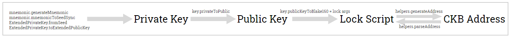

Lumos also provides the functions to manage the keys, addresses and the lock script of a [CKB Account](../preparation/createaccount).

The following figure shows the Lumos functions for the conversion between private key, public key, Lock Script, and CKB address.



## Prerequisites

The following prerequisites apply for the examples in this guide:

- The development environment is set up. For more information, see [Set Up the Development Environment](http://localhost:3000/lumos_doc/docs/preparation/setupsystem).
- The CKB node is installed and started on DEV chain. For more information, see [Install a CKB Node](http://localhost:3000/lumos_doc/docs/preparation/installckb).
- The Lumos packages (`@ckb-lumos/base`, `@ckb-lumos/indexer`, `@ckb-lumos/helpers`, `@ckb-lumos/config-manager`, `@ckb-lumos/hd`, `@ckb-lumos/hd-cache`) are installed.

## Environment

The following examples are verified on Ubuntu 20.04.2. Steps on the other platforms can be adjusted accordingly.

## Examples

### Generate Extended Keys

The HD wallet manager (`@ckb-lumos/hd`) provides the following functions for generating extended keys based on BIP-39:

- [mnemonic.generateMnemonic](https://github.com/nervosnetwork/lumos/blob/develop/packages/hd/src/mnemonic/index.ts#L173): Generates mnemonic words (12 words).
- [mnemonic.mnemonicToSeedSync](https://github.com/nervosnetwork/lumos/blob/c3bd18e6baac9c283995f25d226a689970dc9537/packages/hd/src/mnemonic/index.ts#L48): Generates a seed from mnemonic words.
- [ExtendedPrivateKey.fromSeed](https://github.com/nervosnetwork/lumos/blob/c3bd18e6baac9c283995f25d226a689970dc9537/packages/hd/src/extended_key.ts#L133): Generates an extended private key from a seed.
- [ExtendedPrivateKey.toExtendedPublicKey](https://github.com/nervosnetwork/lumos/blob/c3bd18e6baac9c283995f25d226a689970dc9537/packages/hd/src/extended_key.ts#L113): Generates an extended public key from an extended private key.

Example:

```typescript title="hellolumos/src/manageaccounts.ts/generateKey()" {4,6,7,10}
import { mnemonic, ExtendedPrivateKey } from "@ckb-lumos/hd";

export async function generateKey(){
  const m = mnemonic.generateMnemonic();
  console.log("The mnemonic is",m);
  const seed = mnemonic.mnemonicToSeedSync(m);
  const extendedPrivateKey = ExtendedPrivateKey.fromSeed(seed);
  console.log(extendedPrivateKey);
  
  const publickey = extendedPrivateKey.toExtendedPublicKey().publicKey;
  console.log("The public key is", publickey);
}
```

Try the `generateKey` function in the Node.js REPL mode:


<details><summary>CLICK ME</summary>
<p>


```shell {1,4,6}
$ node --experimental-repl-await
Welcome to Node.js v14.0.0.
Type ".help" for more information.
> const { accounts, manageaccounts}=require(".");
The server is started.
> await manageaccounts.generateKey();
The mnemonic is put sweet bomb route thrive version evoke about excite pumpkin voyage tragic
ExtendedPrivateKey {
  privateKey: '0xb0551ab24a366ae15fe8cbf450d275ed5c5dd72f2a8de0fbc74072230c05aa6c',
  chainCode: '0x821f8011f21b00a82c832f1208367e31456bc81a7c1909e01d337a240bd629ed'
}
The public key is 0x022186277d6626f615ec926d1a5c79ba7d6dd459e27597b68c4797e45336a2ba20
```
</p>
</details>

### Generate the Public Key from a Private Key

The key module of the `@ckb-lumos/hd` package supports producing a public key from a private key based on the secp256k1 standard.

The following example uses the [key.privateToPublic](https://github.com/nervosnetwork/lumos/blob/c3bd18e6baac9c283995f25d226a689970dc9537/packages/hd/src/key.ts#L51) function to generate the public key from a private key.

Example:

```typescript title="hellolumos/src/manageaccounts.ts/private2Public()" {6}
import { key } from "@ckb-lumos/hd";

export async function private2Public (
  privatekey: HexString
):Promise<HexString> {
  const pubkey = key.privateToPublic(privatekey);
  
  console.log("The public key is",pubkey);
  return pubkey;
}
```

### Generate Args from a Public Key

The [key.publicKeyToBlake160](https://github.com/nervosnetwork/lumos/blob/c3bd18e6baac9c283995f25d226a689970dc9537/packages/hd/src/key.ts#L70) function uses blake160 that extracts the first 20 bytes of a public key hash to generate the args.

Example:

```typescript title="hellolumos/src/manageaccounts.ts/public2Args()" {6}
import { key } from "@ckb-lumos/hd";

export async function public2Args (
  publicKey: HexString
):Promise<string> {
  const args = key.publicKeyToBlake160(publicKey);
  
  console.log("The args is",args);
  return args;
}
```

### Recover the Public Key from a Signature and a Signed Message

Signatures are based on elliptic curve private/public key pairs. The public key is recoverable from the signature. 

The [key.recoverFromSignature](https://github.com/nervosnetwork/lumos/blob/c3bd18e6baac9c283995f25d226a689970dc9537/packages/hd/src/key.ts#L27) function can recover the public key from a signature and a signed message.

Example:

```typescript title="hellolumos/src/manageaccounts.ts/signature2PublicKey()" {7}
import { key } from "@ckb-lumos/hd";

export async function signature2PublicKey (
  message: HexString,
  signature: HexString
):Promise<HexString> {
  const pubkey = key.recoverFromSignature(message,signature);
  
  console.log("The public key is",pubkey);
  return pubkey;
  
}
```

### Generate a Keystore File

> A keystore file provides storage for keys. The ckb-cli tool or wallets like the [Neuron Wallet](https://docs.nervos.org/docs/basics/guides/neuron#3-create-a-new-wallet-or-import-existing-keystore-file-or-seed-phrase-to-the-neuron-wallet) can import keystore files to recover the wallets.

The [Keystore](https://github.com/nervosnetwork/lumos/blob/c3bd18e6baac9c283995f25d226a689970dc9537/packages/hd/src/keystore.ts#L55) module of the `@ckb-lumos/hd` package supports to generate keystore files froma private key and a password that encrypts the keystore file. 

The following example generates a keystore with an extended private key by using the [Keystore.create](https://github.com/nervosnetwork/lumos/blob/c3bd18e6baac9c283995f25d226a689970dc9537/packages/hd/src/keystore.ts#L144) function, and then saves the keystore file by using the [Keystore.save](https://github.com/nervosnetwork/lumos/blob/c3bd18e6baac9c283995f25d226a689970dc9537/packages/hd/src/keystore.ts#L92) function. The default name for the keystore file is `${id}.json`.

Example:

```typescript title="hellolumos/src/manageaccounts.ts/generateKeystore()" {14,15}
import { Keystore } from "@ckb-lumos/hd";

export async function generateKeystore(
  password: string,
  path: string,
  name: string,
  overwrite: boolean | undefined
  ){
    const m = mnemonic.generateMnemonic();
    console.log("The mnemonic is",m);
    const seed = mnemonic.mnemonicToSeedSync(m);
    const extendedPrivateKey = ExtendedPrivateKey.fromSeed(seed);
    console.log("The extendedPrivateKey is", extendedPrivateKey);
    const keystore = Keystore.create(extendedPrivateKey,password);
    keystore.save(path,{name, overwrite});
  }
```

Try the `generateKeystore` function in the Node.js REPL mode:


<details><summary>CLICK ME</summary>
<p>


```shell {1,4,6}
$ node --experimental-repl-await
Welcome to Node.js v14.0.0.
Type ".help" for more information.
> const { manageaccounts}=require(".");
The server is started.
> await manageaccounts.generateKeystore("test","C:\\test","keystore.json",true);
The mnemonic is catalog hero they audit liquid struggle topic enter cotton expire sugar cause
The extendedPrivateKey is ExtendedPrivateKey {
  privateKey: '0x641e26e91e605740b62aa678816af5b82591e977648a90f8d556f4e39962178c',
  chainCode: '0x25a4c28fcdf5a74789536e5f368f931436ee70e38537e7e305db4bd497b732e8'
}
```

</p>
</details>

### Generate an XPub Key File from an Extended Private Key

> An xPub Key (extended public key) can be used to derive a unique address for every transaction.

The [XPubStore](https://github.com/nervosnetwork/lumos/blob/c3bd18e6baac9c283995f25d226a689970dc9537/packages/hd/src/xpub_store.ts#L4) class of the `@ckb-lumos/hd` package supports to generate xPub key files from extended private keys.

Example:

```typescript title="hellolumos/src/manageaccounts.ts/generateXpubStore()" {9,10}
import { ExtendedPrivateKey, XPubStore } from "@ckb-lumos/hd";

export async function generateXPubStore(
    extendedPrivateKey: ExtendedPrivateKey,
    path: string,
    overwrite: boolean | undefined
  ){
    const accountExtendedPublicKey = extendedPrivateKey.toAccountExtendedPublicKey();
    const xpubstore = new XPubStore(accountExtendedPublicKey);
    xpubstore.save(path,{overwrite});
}
```

Try the `generateXPubStore` function in the Node.js REPL mode:


<details><summary>CLICK ME</summary>
<p>


```javascript {1,4,6-10}
$ node --experimental-repl-await
Welcome to Node.js v14.0.0.
Type ".help" for more information.
> const { manageaccounts}=require(".");
The server is started.
> const {ExtendedPrivateKey}=require("@ckb-lumos/hd");
> const privateKey="0x5503cc1d40b9e05a46fe8e1d4702786c624a1b5e774f964db6746ea754b4843a";
> const chainCode = "0x568e6eba7d3be6edf051d5de2e0384637c82f1a2e5bab56f5431b2978bd73a27";
> const extendedPrivateKey = new ExtendedPrivateKey(privateKey,chainCode);
> await manageaccounts.generateXPubStore(extendedPK,"C:\\xpub",true);
>//The example generates a xpub file under the C:\ disk.
>//The generated content of this example is "{"xpubkey":"027f5e9f79ff3739990a0a4581304d3128cbe0f22ee6274c6601defc87c04986cbcd1efd7be4123e6cd9d15a434407661b30b570ef0b9d444553cfec4527ec8ee3"}".
```

</p>
</details>

### Get the Balance by Using the HD Cache Manager

A DApp can serve queries on HD wallets in an efficient way by using the HD cache manager (`@ckb-lumos/hd-cache`) component that can store the following data of an HD wallet:

- The master public key
- The next receiving public key
- The next change public key
- The receiving keys
- The change keys
- The balance of the HD wallet

The HD cache manager can load the data of HD wallets from mnemonic words with the [CacheManager.fromMnemonic](https://github.com/nervosnetwork/lumos/blob/c3bd18e6baac9c283995f25d226a689970dc9537/packages/hd-cache/src/index.ts#L605) function or from a keystore file with the [CacheManager.loadFromKeystore](https://github.com/nervosnetwork/lumos/blob/c3bd18e6baac9c283995f25d226a689970dc9537/packages/hd-cache/src/index.ts#L571) function.

If the keystore file is generated by the ckb-cli tool (the keystore file contains `"origin":"ckb-cli"`), or the <var>needMasterPublicKey</var> variable is set as <var>true</var>, the HD cache manager loads the data for all keys including the master public key.

The following example loads the data from a keystore file of an HD wallet, and then uses the [getBalance](https://github.com/nervosnetwork/lumos/blob/c3bd18e6baac9c283995f25d226a689970dc9537/packages/hd-cache/src/index.ts#L767) function to get the balance of the HD wallet. 

Example:

```typescript title="/mydapp/src/manageaccounts.ts/getBalancebyHDCache()" {14}
export async function getBalancebyHDCache (
  path:string,
  password: string,
  needMasterPublicKey: boolean
 )  {
   const cacheManager = CacheManager.loadFromKeystore(INDEXER, path, password,getDefaultInfos(),{needMasterPublicKey}); 
   cacheManager.startForever();
  //  console.log("The master public key info is", cacheManager.getMasterPublicKeyInfo());
  //  console.log("The next receiving public key info is", cacheManager.getNextReceivingPublicKeyInfo());
  //  console.log("The next change public key info is",cacheManager.getNextChangePublicKeyInfo());
  //  console.log("The receiving keys are",cacheManager.getReceivingKeys());
  //@ts-ignore
  await cacheManager.cache.loop();
  const balance = await getBalance(new CellCollector(cacheManager));
  console.log("The HD wallet balance is", BigInt(balance));
 }
```

Try the `getBalancebyHDCache` function in the Node.js REPL mode:


<details><summary>CLICK ME</summary>
<p>


```javascript {1,4,7,10}
$ node --experimental-repl-await
Welcome to Node.js v14.0.0.
Type ".help" for more information.
> const { manageaccounts }=require(".");
The server is started.
// Set the needMasterPublicKey variable as false to get the balance for all keys except the master public key
> await manageaccounts.getBalancebyHDCache("C:\\test\\keystore","test", false);
The HD wallet balance is 40000000000n
// Set the needMasterPublicKey variable as true to get the balance for all keys including the master public key
> await manageaccounts.getBalancebyHDCache("C:\\test\\keystore","test", true);
The HD wallet balance is 2833614223561041n
```

</p>
</details>

### Generate the Address from a Lock Script

The [generateAddress](https://github.com/nervosnetwork/lumos/blob/c3bd18e6baac9c283995f25d226a689970dc9537/packages/helpers/src/index.ts#L89) function of the `@ckb-lumos/helpers` package can be used to generate the address from a specific lock script.

Example:

```typescript title="hellolumos/src/manageaccounts.ts/generateAddressfromLock()" {7}
import { generateAddress } from "@ckb-lumos/helpers";

export async function generateAddressfromLock(
  lockScript:Script,
  config: Config
)  {
  const address = generateAddress(lockScript, {config});
  console.log("The address for the lockscript is", address);  
}
```

Try the `generateAddressfromLock` function in the Node.js REPL mode:


<details><summary>CLICK ME</summary>
<p>


```bash {1,4,6-9}
$ node --experimental-repl-await
Welcome to Node.js v14.0.0.
Type ".help" for more information.
> const { accounts, manageaccounts, CONFIG}=require(".");
The server is started.
> const alice = accounts.ALICE;
> const { parseAddress }=require("@ckb-lumos/helpers");
> const script = parseAddress(alice.ADDRESS);
> const address = await manageaccounts.generateAddressfromLock(script,CONFIG);
The address for the lockscript is ckt1qyq8uqrxpw9tzg4u5waydrzmdmh8raqt0k8qmuetsf
```

</p>
</details>

### Get the Lock Script from an Address

The [parseAddress](https://github.com/nervosnetwork/lumos/blob/c3bd18e6baac9c283995f25d226a689970dc9537/packages/helpers/src/index.ts#L145) function of the `@ckb-lumos/helpers` package can be used to get the lock script from an address.

Example:

```typescript title="hellolumos/src/manageaccounts.ts/generatelockFromAddress()" {6}
import { parseAddress } from "@ckb-lumos/helpers";

export async function generateLockFromAddress (
  address:Address
)  {
  const lockscript = parseAddress(address);
  console.log("The lockscript of the address is", lockscript);  
}
```

Try the `generatelockFromAddress` function in the Node.js REPL mode: 

<details><summary>CLICK ME</summary>
<p>


```shell {1,4,6,7}
$ node --experimental-repl-await
Welcome to Node.js v14.0.0.
Type ".help" for more information.
> const { accounts, manageaccounts }=require(".");
The server is started.
> const alice = accounts.ALICE;
> await manageaccounts.generateLockFromAddress(alice.ADDRESS);
The lockscript of the address is {
  code_hash: '0x9bd7e06f3ecf4be0f2fcd2188b23f1b9fcc88e5d4b65a8637b17723bbda3cce8',
  hash_type: 'type',
  args: '0x7e00660b8ab122bca3ba468c5b6eee71f40b7d8e'
}
```

</p>
</details>

### Generate the Lock Hash from a Lock Script

The [computeScriptHash](https://github.com/nervosnetwork/lumos/blob/c3bd18e6baac9c283995f25d226a689970dc9537/packages/base/lib/utils.js#L73) function generates the hash value for a specific lock script.

```typescript title="hellolumos/src/manageaccounts.ts/generateLockHash()" {7}
import { utils } from "@ckb-lumos/base";
const {  computeScriptHash } = utils;

export async function generateLockHash(
  lock:Script
  ){
    const lockHash = computeScriptHash(lock);
    console.log("The lockHash is", lockHash);
}
```

### Generate an Account from a Private Key

```typescript title="hellolumos/src/manageaccounts.ts/generateAccountFromPrivateKey()"
import { parseAddress} from "@ckb-lumos/helpers";
import { utils, Address, Hash, Script, HexString } from "@ckb-lumos/base";
const { computeScriptHash } = utils;
import { key } from "@ckb-lumos/hd";

export type Account = {
  lockScript: Script;
  lockHash: Hash;
  address: Address;
  pubKey: string;
  lockScriptMeta?: any;
}
export const generateAccountFromPrivateKey = (privKey: string): Account => {
  const pubKey = key.privateToPublic(privKey);
  const args = key.publicKeyToBlake160(pubKey);
  const template = CONFIG.SCRIPTS["SECP256K1_BLAKE160"]!
  const lockScript = {    
    code_hash: template.CODE_HASH,
    hash_type: template.HASH_TYPE,
    args: args
  };
  const address = generateAddress(lockScript);
  const lockHash = computeScriptHash(lockScript);
  return {
    lockScript,
    lockHash,
    address,
    pubKey,
  }
}
```

Try the `generateAccountFromPrivateKey` function in the Node.js REPL mode: 

<details><summary>CLICK ME</summary>
<p>


```shell {1,4,6,7}
$ node --experimental-repl-await
Welcome to Node.js v14.0.0.
Type ".help" for more information.
> const { accounts, manageaccounts }=require(".");
The server is started.
> const alice = accounts.ALICE;
> await manageaccounts.generateAccountFromPrivateKey(alice.PRIVATE_KEY);
{
  lockScript: {
    code_hash: '0x9bd7e06f3ecf4be0f2fcd2188b23f1b9fcc88e5d4b65a8637b17723bbda3cce8',
    hash_type: 'type',
    args: '0x7e00660b8ab122bca3ba468c5b6eee71f40b7d8e'
  },
  lockHash: '0xf6ea009a4829de7aeecd75f3ae6bcdbaacf7328074ae52a48456a8793a4b1cca',
  address: 'ckt1qyq8uqrxpw9tzg4u5waydrzmdmh8raqt0k8qmuetsf',
  pubKey: '0x02963f88be6c4163a68abf0539facdfc2a77064c6091f618953a230caeacf5237e'
}
```

</p>
</details>